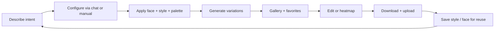

# Building ViewBAIT Into a Full Product

## From thumbnail idea to a creator studio that actually ships

ViewBAIT started with a simple question: what if a YouTube creator could describe a thumbnail in plain language and get scroll-stopping results in seconds, without opening Photoshop or fighting a template library?

The answer was not a single AI button. It was a full product: a dark, focused studio where generation, faces, styles, palettes, chat, YouTube context, subscriptions, and iteration all connect in one workflow. Creators sign up, open the studio, describe what they want, and leave with thumbnails they can download, favorite, refine, and reuse.

This case study explains what ViewBAIT is, how its features work, and how they fit together to create the ViewBAIT experience.

---

## The problem

Thumbnail creation is one of the highest-leverage tasks in a creator's workflow, and one of the most painful.

Most creators face the same friction:

- **Time:** Manual design in Photoshop or Canva can eat 30 to 60 minutes per video.
- **Skill:** Not every creator is a designer, but every creator needs visuals that compete on the browse page.
- **Consistency:** Brand look, face placement, and color treatment are hard to repeat across dozens of uploads.
- **Iteration:** Testing hooks and layouts means regenerating from scratch, not refining in place.
- **Platform fit:** YouTube, Shorts, TikTok, and cross-posting need different aspect ratios and resolutions.

Generic design tools solve "make an image." They do not solve "make *my* thumbnail, with *my* face, in *my* style, for *this* video, fast enough that I still have energy to edit."

ViewBAIT is built around that gap.

---

## What ViewBAIT is

**ViewBAIT** (ViewBait.app) is an AI-powered thumbnail generator for YouTube creators and video teams. Users describe what they want. The system generates professional thumbnail concepts with optional face integration, reusable styles, color palettes, and platform-specific output settings.

The product centers on three outcomes:

1. **Speed:** First usable thumbnail in minutes, not hours.
2. **Control:** Your face, your palette, your style, not a random stock template.
3. **Iteration:** Generate variations, edit with prompts, save what works, and reuse it on the next upload.

ViewBAIT is not a general image editor, a face-swap toy, or a static template marketplace. It is a creator studio built specifically for thumbnail performance.

---

## The ViewBAIT experience: one studio, many connected systems

At the center of the product is **the Studio** (`/studio`): a single-page workspace with a left-to-right mental model.

| Zone                       | Role                                                                                             |
| -------------------------- | ------------------------------------------------------------------------------------------------ |
| **Navigation (left)**      | Move between Generator, Gallery, YouTube, Faces, Styles, Palettes, Browse, Assistant, and more   |
| **Configuration (center)** | Manual controls or conversational chat to set title, style, face, palette, ratio, and resolution |
| **Results (right)**        | Live feed of generations, previews, downloads, favorites, edits, and heatmaps                    |

On mobile, the same model collapses into tabs. The experience stays consistent because the underlying state is shared. Chat does not live in a separate app. YouTube context does not live in a spreadsheet. Everything feeds the same generator.

That shared state is what turns a collection of features into a product.

---

## Core feature: AI thumbnail generation

Generation is the heart of ViewBAIT. Users provide:

- **Thumbnail text:** The hook, title overlay, or concept description
- **Style:** A preset or custom saved style
- **Color palette:** Curated or custom hex combinations
- **Aspect ratio:** 16:9 for YouTube, 9:16 for Shorts, 1:1, and more by tier
- **Resolution:** 1K, 2K, or 4K (tier-gated)
- **Variations:** Multiple options in one run for A/B testing

The server builds a structured prompt, calls Gemini image generation, stores the result in Supabase Storage, and returns signed URLs to the client. Credits deduct atomically by resolution. Tier rules enforce allowed ratios, cooldowns, and watermark behavior.

**Why it matters in the full product:** Every other feature (faces, styles, chat, YouTube analysis) exists to make this generation step faster, more consistent, and more on-brand.

---

## Face library: your face, every thumbnail

Creators upload reference photos once and reuse them across generations.

The face system supports:

- **Multiple saved faces:** Self, co-host, guest, character
- **Emotion and pose:** Shocked, excited, pointing, hands up, and more
- **Multi-face compositions:** More than one person in a single thumbnail
- **Position hints:** Left, right, center, or custom placement

Faces live in **My Faces**, a dedicated studio view. When a user enables face integration in the generator, selected references flow into the image prompt so the model composes naturally instead of pasting a cutout.

**How it connects:** A returning creator types "reaction thumbnail, shocked face, pointing at the screen" in chat. The assistant pre-fills face settings. The generator runs. The gallery stores the result. The next video reuses the same face library without re-uploading.

---

## Style system: brand memory, not one-off luck

Styles are how ViewBAIT turns a great accidental result into a repeatable look.

Users can:

- **Browse default styles:** Cinematic, bold, minimalist, retro, and other curated presets
- **Create custom styles:** Name, description, optional reference images, preview generation
- **Favorite and reuse:** Save styles that define a channel's visual identity
- **Discover public styles:** Browse community and shared presets

A saved style captures more than a filter name. It encodes composition, mood, text treatment, and color behavior so the next generation starts closer to "on brand."

**How it connects:** Chat can surface the Style Selection section and set `selectedStyle` by name. YouTube video analysis can suggest style hints from video tone. Browse lets new users start fast without building a library from zero.

---

## Color palettes: contrast that survives the browse page

Palettes complement styles with explicit color control.

- **Default palettes:** High-contrast pairs built for thumbnail readability
- **Custom palettes:** Hex pickers and saved personal combinations
- **AI palette extraction:** Pull colors from a reference image
- **My Palettes:** Reuse the same scheme across a series or campaign

**How it connects:** Palettes ride alongside styles in the generator form. The chat assistant resolves palette names to IDs and applies them through shared form state. The result is a thumbnail that pops at small sizes on mobile YouTube feeds.

---

## Conversational AI: the assistant is the interface

ViewBAIT treats conversation as a first-class creation mode, not a sidebar gimmick.

In **Chat mode**, users talk to a thumbnail assistant that:

- Interprets natural language ("make this more dramatic," "use my gaming style," "3 variations, 16:9")
- Returns a human-readable reply plus **structured UI updates**
- Surfaces 1–2 relevant generator sections per turn via `DynamicUIRenderer`
- Pre-fills form state (title, style, palette, face, ratio, resolution, variations)
- Offers suggestion chips and tier upgrade prompts when a feature requires a higher plan

Manual mode and chat mode share the **same form state** in `StudioProvider`. The user can switch modes without losing context. Chat guides. Manual fine-tunes. Generate executes.

The assistant can also ground responses with search when helpful, create feedback entries, and (for Pro users with YouTube connected) analyze videos or extract style cues from reference content.

**How it connects:** Chat lowers the learning curve for new users, speeds up power users who think in sentences instead of dropdowns, and bridges into YouTube-aware workflows when video context is available.

---

## YouTube integration: thumbnails tied to real channel data

For Pro subscribers, ViewBAIT connects to YouTube through OAuth and becomes channel-aware.

The **YouTube tab** in the studio lets users:

- Browse their uploaded videos
- Open video detail and analytics context
- Run **video analysis** (Pro) to extract summary, hooks, key moments, tone, and thumbnail appeal notes
- **Suggest thumbnail concepts** from that analysis (2–4 one-click prompts)
- **Re-roll with video context** so custom instructions include the full video understanding summary
- Use the **YouTube AI Assistant** to ask questions about channel performance, video lists, comments, and analytics

The Pro assistant uses a controlled **tool registry** on the server. Each tool has a schema, handler, and explicit gating. The model does not get raw database access. It calls `list_my_videos`, `get_channel_analytics`, `get_video_details`, and similar tools with the authenticated user's scope.

The assistant can also help with thumbnail creation inside the same chat thread, calling `thumbnail_assistant_response` to push form updates back into the generator.

**How it connects:** YouTube supplies the *what* (video title, hooks, performance context). ViewBAIT supplies the *how it should look* (style, face, palette, generation). The loop closes when a concept becomes a downloaded thumbnail ready to upload.

---

## Gallery, favorites, and projects: iteration without amnesia

Every generation lands in a persistent workflow:

- **Gallery:** Masonry view of past thumbnails with download and delete
- **Favorites:** Heart the winners for fast recall
- **AI Edit:** Post-generation prompt adjustments without a full re-roll
- **Projects:** Organize work by campaign, series, or client

Signed storage URLs refresh automatically when lists load, so creators always see current previews.

**How it connects:** Gallery is the memory layer. Styles and faces are the reuse layer. YouTube and chat are the ideation layer. Together they support the real creator loop: generate, compare, pick, tweak, save, repeat next week.

---

## Attention heatmap: see where eyes land first

For **Advanced** and **Pro** tiers, ViewBAIT adds an attention heatmap on thumbnail cards.

Flow:

1. User clicks the heatmap action on a generated thumbnail or YouTube video card
2. The server generates a heatmap image from the exact thumbnail shown
3. User toggles the overlay to compare predicted focal points against the design

This is tier-gated in both UI and API (`POST /api/thumbnails/heatmap` returns 403 for lower tiers). The pattern (hide in UI, enforce on server) is the standard for premium features across the product.

**How it connects:** Heatmaps close the feedback loop between "I like how this looks" and "this layout actually directs attention." It turns ViewBAIT from pure generation into thumbnail *judgment*.

---

## AI title enhancement: better hooks, more variations

Starter tier and above unlock **title enhancement**: enter a topic, receive multiple clickable title suggestions, select several, and generate one thumbnail per title.

This supports A/B testing at the copy layer before the visual layer settles.

**How it connects:** Enhanced titles feed directly into `thumbnailText`. Chat can refine them further. YouTube video titles can seed the same field. The product treats the hook text and the visual as one system.

---

## Subscription tiers: free trial to pro studio

ViewBAIT uses Stripe subscriptions with a credit-based generation model.

| Tier                  | Monthly credits | Resolution | Key unlocks                                         |
| --------------------- | --------------- | ---------- | --------------------------------------------------- |
| **Free**              | 10              | 1K         | 16:9 only, watermark, 30-day storage                |
| **Starter** ($19.99)  | 100             | 1K, 2K     | No watermark, title enhancement, more aspect ratios |
| **Advanced** ($49.99) | 300             | Up to 4K   | Priority generation, attention heatmap              |
| **Pro** ($99.99)      | 700             | Up to 4K   | YouTube assistant, video analysis, fastest cooldown |

Credits scale by resolution (1K = 1 credit, 2K = 2, 4K = 4). Generate cooldowns shorten at higher tiers to support rapid iteration without abuse.

**How it connects:** Tier gating is consistent everywhere: sidebar locks, API 403s, and upgrade modals from chat. Users discover premium value inside real workflows (YouTube tab, heatmap, 4K), not on a disconnected pricing page.

---

## How the features work together: the creator loop

ViewBAIT is designed as a loop, not a checklist.

**First-time user path**

1. Land on marketing site, sign up
2. Enter studio, see welcome flow or onboarding (`/onboarding` walks name → optional face → style → first generation)
3. Upload a face (optional), pick a public style, generate
4. Download result, open studio for the full toolset

**Returning creator path**

1. Open studio, gallery shows recent work
2. Type "reaction thumbnail for my new video" in chat
3. Assistant sets style, face, 16:9, 4 variations
4. Pick favorite from live feed, run AI edit for a small tweak
5. Favorite it, reuse saved style next upload

**Pro / YouTube path**

1. Connect channel
2. Open a video, run analysis, suggest concepts
3. "Use this" pre-fills generator with video-aware custom instructions
4. Ask assistant about CTR context or recent uploads
5. Generate, heatmap the winner, download for upload

Each step reuses the same studio state, the same API contracts, and the same libraries. That is the product experience: not ten isolated tools, but one studio that remembers who you are and how you work.

---

## Technical foundation (what makes it real)

Behind the UI, ViewBAIT is a production web application:

- **Frontend:** Next.js App Router, React 19, Tailwind CSS, shadcn/ui, TanStack Query
- **Backend:** Next.js API routes, Supabase Auth, PostgreSQL with RLS, Supabase Storage
- **AI:** Google Gemini for image generation, chat, video understanding, and heatmaps
- **Payments:** Stripe subscriptions and webhooks
- **Security:** Server-only secrets, `requireAuth` on protected routes, atomic credit RPC, sanitized client errors

Middleware protects `/studio`. API routes enforce auth and tier per endpoint. Service role access is limited to cases that truly require it (credits, webhooks, OAuth token persistence). Prompt construction never ships to the browser.

This architecture supports the product principles in `agentics/VISION.md`: conversation first, left-to-right flow, mobile parity, and speed over perfection.

---

## What this case study shows

ViewBAIT is more than an AI thumbnail demo. It is a full creator product with:

- Authenticated accounts and profiles
- A unified studio workspace
- AI generation with tier-aware credits and cooldowns
- Reusable faces, styles, and palettes
- Conversational and manual creation modes sharing one form
- YouTube OAuth, video analysis, and a Pro AI assistant with tool gating
- Gallery, favorites, edit, and heatmap feedback loops
- Stripe subscriptions with consistent premium gating
- Onboarding, referrals, notifications, and analytics hooks

The deeper point: these systems are composable patterns. A thumbnail studio today can inform a cover-art tool, a course creator portal, a social content hub, or any product where users describe what they want, iterate visually, and reuse brand memory over time.

---

## Why this matters

Creators do not need another generic design app. They need a workflow that respects how uploads actually happen: fast hooks, recognizable faces, consistent branding, platform-specific output, and room to test before publish.

ViewBAIT builds that workflow end to end.

Describe it. Configure it in chat or controls. Generate variations. Judge with heatmaps. Save what works. Connect YouTube when ready. Come back next video without starting from zero.

That is the ViewBAIT experience: AI speed with creator control, packaged as a product people can sign up for, pay for, and return to every upload cycle.

---

## Meta (for publication)

| Field                          | Value                                                                                                                                                        |
| ------------------------------ | ------------------------------------------------------------------------------------------------------------------------------------------------------------ |
| **Primary job**                | Explain ViewBAIT as a complete creator product and how features compose                                                                                      |
| **Primary KPI**                | Studio signups and first-generation completion                                                                                                               |
| **Supporting KPIs**            | Organic landing CTR, chat mode adoption, Pro upgrade from YouTube/heatmap touchpoints                                                                        |
| **Suggested page title**       | Building ViewBAIT Into a Full Product | AI Thumbnail Studio Case Study                                                                                       |
| **Suggested meta description** | How ViewBAIT grew from an AI thumbnail idea into a full creator studio with faces, styles, chat, YouTube context, and subscriptions working as one workflow. |
| **Canonical path**             | `/articles/building-viewbait-into-a-full-product` (when published)                                                                                           |
| **Refresh trigger**            | New tier features, major studio views, or YouTube assistant scope changes                                                                                    |

---

*ViewBAIT: Describe what you want. Get scroll-stopping thumbnails. [ViewBait.app](https://viewbait.app)*