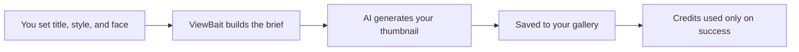

# How ViewBait Creates Your Thumbnails

**ViewBait.app** · [Open the studio](https://viewbait.app)  
**Last updated:** June 2026

You pick a title, a look, maybe your face. ViewBait returns a thumbnail built for clicks. This is how that process works, and why we designed it the way we did.

---

## At a glance

| | |
|---|---|
| **What you do** | Describe your thumbnail in plain language: text, style, colors, expression, aspect ratio. |
| **What ViewBait does** | Translates your choices into a precise creative brief, generates the image, and saves it to your gallery. |
| **What you get** | A high-resolution thumbnail ready for YouTube, plus smaller versions that load fast in your library. |
| **What you do not do** | Write AI prompts, manage reference image order, or pay for images that failed to generate. |

---

## Why thumbnail generation is harder than it looks

A good YouTube thumbnail is not just a pretty picture. It needs readable text, a clear focal point, your face looking natural (not pasted on), and a style that matches your channel.

Generic AI tools ask you to type a long prompt and hope for the best. That breaks down fast when you want:

- **Your actual face** in the shot, not a random person
- **The same visual style** across dozens of videos
- **Several options at once** so you can pick the best one
- **Fair billing** when the AI hiccups or times out

ViewBait is built around those real creator needs, not around demo-quality one-off images.

---

## Your journey in the studio

### 1. You describe the thumbnail

In the studio you choose:

- **Title text** (or no text at all for a visual-only thumbnail)
- **Style** from presets or your saved custom looks
- **Color palette** to keep branding consistent
- **Expression and pose** (shocked, pointing, thumbs up, and more)
- **Format** such as 16:9 for long-form YouTube or 9:16 for Shorts
- **Quality** from standard to 4K, depending on your plan
- **Variations** so you can compare 2, 3, or 4 options in one run

You can also pick which AI model powers the generation: **Nano Banana Pro**, **Nano Banana 2**, or **GPT Image 2**. Each has a slightly different strength. You stay in control without learning prompt syntax.

### 2. ViewBait turns your choices into a creative brief

Behind the scenes, ViewBait does not send a vague sentence to the AI. It builds a detailed brief that covers:

- **Exact title rules.** If you added text, the main title and any subtitle are spelled out clearly. If you left text blank, the brief says no words, numbers, or captions anywhere in the image.
- **Style and color.** Your saved style and palette are included so results feel on-brand.
- **Your face.** Photos from your face library are grouped by person. The AI is told which images belong to the same character so your likeness stays consistent.
- **Reference images.** If you attached style references, ViewBait labels them separately from face photos so the AI knows what to copy (lighting, layout) vs who to draw.

You never see this brief. You just see better, more predictable results.

### 3. The image is generated

ViewBait sends your brief and reference photos to the model you selected. If you asked for multiple variations, they are created in parallel so you wait once, not four times.

When reference images are involved, ViewBait uses the right generation mode for each model so faces and styles are composed naturally instead of looking like a bad cut-and-paste.

### 4. Your thumbnail lands in the gallery

Every successful image is saved to your private gallery at full resolution. ViewBait also creates lighter versions so scrolling through past thumbnails stays fast.

If something goes wrong on one variation in a batch, the others can still succeed. You are not charged for the ones that failed.

---

## The features that make a real difference

### Your face library

Upload reference photos once. Reuse them on every video. ViewBait can place you (or a co-host) in the scene with the expression and pose you picked. Multiple people in one thumbnail are supported when your plan allows it.

### Styles you can repeat

Found a look you love? Save it as a custom style. Next time you generate, one click applies the same mood, colors, and composition. You can even preview a style before committing to it.

### Variations for A/B testing

Strong creators rarely ship the first draft. Generate up to four versions in one go, compare them side by side, and pick the one with the most stop-the-scroll energy.

### Fair credits

ViewBait checks that you have enough credits before starting. Credits are used **only when a thumbnail actually generates**. A timeout, a busy AI service, or a failed variation does not eat your balance.

Higher resolutions use more credits. Your plan controls which formats and quality levels are available.

### Clear errors, not jargon

When generation fails, you get a plain message: try again in a moment, adjust your prompt, or check your plan. You will not see raw technical errors from third-party AI services.

---

## Beyond the main generator

The same ideas power other parts of ViewBait:

| Feature | What it does for you |
|---|---|
| **Style preview** | See what a saved style looks like before you use it on a full thumbnail |
| **Thumbnail edit** | Tweak an existing image with a short instruction instead of starting over |
| **Style from references** | Upload example thumbnails and let ViewBait learn a reusable style from them |
| **AI assistant** | Describe what you want in chat and jump into the generator with settings pre-filled |

Everything stays in one studio. Your gallery, faces, and styles connect so each video gets faster than the last.

---

## What good results look like

**Before ViewBait's approach:** Creators wrestled with long prompts, inconsistent faces, one image per attempt, and unclear billing when the AI failed.

**With ViewBait:** You work in a visual studio, reuse your face and brand, batch-test variations, and only pay for thumbnails that land in your gallery.

The goal is simple: less time fighting the tool, more time publishing videos that get clicked.

---

## Tips for your next generation

1. **Split your title with a colon** if you want a big main line and smaller subtext (for example, `I Tried Every AI Tool: So You Don't Have To`).
2. **Add 2–3 face photos per person** from different angles for a more accurate likeness.
3. **Save styles** after a thumbnail you are proud of so your next ten videos match.
4. **Run 2–4 variations** when you are unsure. Pick the winner, not the first draft.
5. **Match aspect ratio to the platform** before you generate. 16:9 for standard YouTube, 9:16 for Shorts.

---

## Try it yourself

Open [viewbait.app](https://viewbait.app), sign in, and generate a thumbnail with a saved face and style. Run two variations and compare them in your gallery.

If you are new, your first successful thumbnail triggers a small celebration in the app. Milestones at 10, 50, and 100 generations are there to remind you that consistency beats perfection on day one.

---

## Questions creators ask

**Do I need to write AI prompts?**  
No. The studio form is your prompt. ViewBait handles the rest.

**Why are there multiple AI models?**  
Different models shine in different situations. You can switch from the model picker without changing anything else.

**What if only 2 of 4 variations succeed?**  
You keep the two that worked. You are charged only for those two.

**Can I generate without any text on the image?**  
Yes. Leave the title empty for a purely visual thumbnail.

**Where are my images stored?**  
In your private gallery, tied to your account. Only you can access them.
