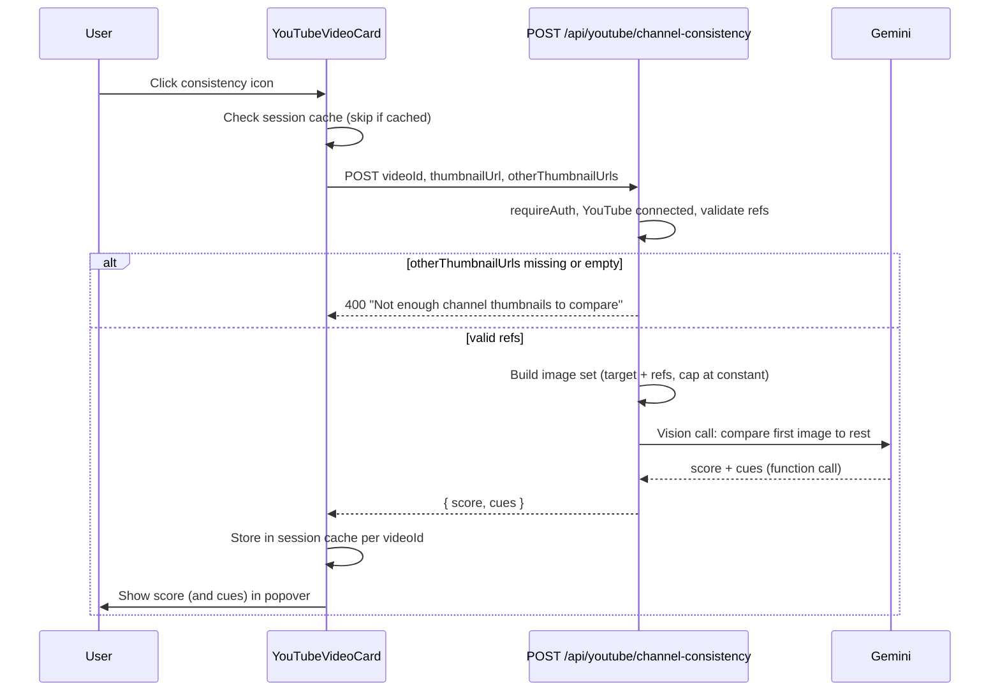

# Channel Consistency Check (YouTube Tab) — Revised Plan

**Based on:** Original plan (Channel Consistency Check, YouTube tab) + [Channel Consistency Check Plan Critique](channel_consistency_check_plan_critique.md).

This revised plan incorporates the critique’s recommendations: MVP requires client-supplied reference thumbnails (no server-side channel fetch); named constant for max reference images; mandatory session cache and optional cooldown; and explicit accessibility, popover behavior, and follow-up notes for server fallback and video ownership.

---

## Goal

Add an icon button to each video card in the **YouTube tab** that, when clicked, analyzes how consistent that video's thumbnail is with the rest of the thumbnails on the user's channel and shows a **consistency score** (and optional short cues).

---

## Scope

- **Entry point:** YouTube tab only (My channel grid). Each [YouTubeVideoCard](viewbait/components/studio/youtube-video-card.tsx) gets a new action-bar icon.
- **Flow:** Click icon → loading state on card → API returns score (e.g. 1–5 or Low/Medium/High) + 1–2 cues → show result in a small popover (or fallback toast).
- **Channel set:** "Rest of channel" = other thumbnails from the same channel (exclude current video). **MVP: client always supplies these** via `otherThumbnailUrls`; server does not fetch channel videos in MVP.

> **[CRITIQUE-BASED UPDATE]** For MVP, the server **requires** `otherThumbnailUrls` and returns 400 when it is missing or empty. This avoids duplicating or extracting the OAuth/playlist logic that currently lives only inside the videos route. "Server-side fallback when client doesn't send refs" is documented as a follow-up and will be implemented via a shared helper (e.g. in the YouTube service) when needed.

---

## Architecture

---

## 1. Backend: New API route

**Path:** `viewbait/app/api/youtube/channel-consistency/route.ts`

**Method:** POST. Body: `{ videoId: string, thumbnailUrl?: string, otherThumbnailUrls: string[] }`.

- **Auth:** `requireAuth(supabase)`. Require YouTube connected (same pattern as [set-thumbnail](viewbait/app/api/youtube/videos/[id]/set-thumbnail/route.ts) and [videos route](viewbait/app/api/youtube/videos/route.ts)). Return 401/404 when not connected.

- **Resolve references (MVP):**
  - **Require** `otherThumbnailUrls` to be present and non-empty. If missing or empty, return **400** with a clear message: e.g. `"Not enough channel thumbnails to compare. Please try again from the YouTube tab."`
  - Cap at a **named constant**: `CHANNEL_CONSISTENCY_MAX_REF_IMAGES = 10`. Slice `otherThumbnailUrls` to this length before fetching images. Use the same constant when documenting the prompt (e.g. "the following N images are other channel thumbnails").

> **[CRITIQUE-BASED UPDATE]** Server-side fetch of user channel videos is **out of scope for MVP**. The OAuth/playlist logic in the videos route is local and not shared; implementing fallback would require either duplication or extracting a shared helper (e.g. `fetchUserChannelVideos(userId, maxResults)` in the YouTube service). When fallback is added later: (1) implement via that shared helper, and (2) validate that `videoId` belongs to the user's channel before running the comparison.

- **Target image:** From `thumbnailUrl` in body if provided; otherwise the client should pass it (required for a valid request). If missing, return 400.

- **Gemini:** One vision call with:
  - **Images:** [target thumbnail, ...reference thumbnails] (order: first = to score, rest = channel). Build `imageData[]` using [fetchImageAsBase64](viewbait/lib/utils/ai-helpers.ts) for each URL.
  - **Prompt:** State explicitly: "The first image is the thumbnail to score; the following N images are other channel thumbnails." Ask the model to compare the first image to the others and rate consistency 1–5 plus 1–2 short cues.
  - **Tool/structured output:** e.g. `channel_consistency_result` with `score` (number 1–5) and `cues` (string[]). Use [callGeminiWithFunctionCalling](viewbait/lib/services/ai-core.ts) with `imageData` as array.

- **Response:** `{ score: number, cues: string[] }`. Use existing error handlers and sanitization (no prompt leakage).

**Tier:** No Pro gate for MVP; any YouTube-connected user can use the feature.

**Dependencies:** `GEMINI_API_KEY`; no server-side YouTube fetch in MVP.

---

## 2. Frontend: Icon button and result display

**File:** [viewbait/components/studio/youtube-video-card.tsx](viewbait/components/studio/youtube-video-card.tsx)

- **New action button** in the existing `actionBar`: e.g. "Channel consistency" / "Does this fit my channel?" with an icon (lucide-react: `Layers`, `LayoutGrid`, or `Gauge`). Use [ActionButton](viewbait/components/studio/action-bar-icon.tsx) for consistency.

- **State:** `isConsistencyLoading`, `consistencyResult: { score: number; cues: string[] } | null` **per videoId**. Implement **session-scoped cache**: if `consistencyResult` is already set for this card’s `videoId`, **skip** the API call and show the cached result in the popover (or allow a "Run again" control if desired). Optionally enforce a **cooldown** (e.g. 5 seconds) before allowing a new request for the same video to avoid double-click cost.

> **[CRITIQUE-BASED UPDATE]** Session cache per videoId is **mandated** to avoid repeated Gemini calls on double-clicks or re-hover. Optional short cooldown (e.g. 5 s) per videoId is recommended.

- **Handler:** On click, if cached result exists, show popover with cached data and do not call API. Otherwise call `POST /api/youtube/channel-consistency` with `{ videoId, thumbnailUrl, otherThumbnailUrls }`. Parent must pass `otherChannelThumbnailUrls` (see below).

- **Result UX:** Show score and cues in a **Popover** anchored to the button. Map numeric score 1–5 to a label (e.g. 1–2 Low, 3 Medium, 4–5 High) and optional color (e.g. low = warning, high = success). Dismiss on outside click.

  - **Popover placement:** Use a portaled popover with a z-index that ensures it appears **above** the card’s HoverCard so it is not clipped.

> **[CRITIQUE-BASED UPDATE]** Ensure the consistency result popover is portaled and has sufficient z-index above the HoverCard.

- **Loading:** Reuse the card’s existing "analyzing" overlay (same as style analysis / video analytics) so the card shows the CRT-style animation while the request is in flight.

- **Errors:** Toast on API error (4xx/5xx); do not store failed state. On 400 (e.g. not enough refs), show the toast message to the user.

- **Accessibility:** The new icon button must have an accessible label (e.g. "Channel consistency" or "Does this fit my channel?"). The popover content (score and cues) should be announced for screen readers (e.g. live region or appropriate aria attributes).

> **[CRITIQUE-BASED UPDATE]** Explicit accessibility requirement added for the button label and popover content.

**Passing `otherThumbnailUrls`:** Parent [StudioViewYouTube](viewbait/components/studio/views/StudioViewYouTube.tsx) computes and passes for each card: `otherChannelThumbnailUrls={filteredVideos.filter(v => v.videoId !== video.videoId).slice(0, 10).map(v => v.thumbnailUrl)}`. Add optional prop to `YouTubeVideoCard`: `otherChannelThumbnailUrls?: string[]`. If the array is empty (e.g. channel has only one video), the button can be disabled or hidden, or the user can click and receive the 400 message in a toast.

---

## 3. Types and service

- **API response type:** `{ score: number; cues: string[] }`. Define in the route or in `lib/types/` if shared.
- **Client:** A small fetcher (e.g. in `lib/services/youtube-channel-consistency.ts` or in `lib/services/youtube.ts`) that calls `POST /api/youtube/channel-consistency` and returns the typed result. Keeps the card free of raw fetch logic.

---

## 4. Edge cases and constraints

- **No YouTube / not connected:** Consistency button is not shown or is disabled when the user is not connected (YouTube tab already hides the grid in that case).
- **Channel with 0 or 1 video:** If `otherChannelThumbnailUrls` is empty (or has length 0), either disable/hide the button in the UI or allow click and show the API’s 400 message (e.g. "Not enough channel thumbnails to compare") in a toast.
- **Rate / cost:** Session cache per videoId is mandatory; optional 5 s cooldown per video before re-requesting. Server-side rate limiting is a follow-up if needed.
- **Score display:** Map 1–5 to Low/Medium/High and optionally use semantic color for quick scan.

---

## 5. Follow-up (out of scope for MVP)

- **Server-side fallback:** When the client does not send `otherThumbnailUrls`, the server could fetch the user’s channel videos. This must be implemented by **extracting** a shared helper (e.g. `fetchUserChannelVideos(userId, maxResults)`) that uses the same token and playlist logic as the videos route, and calling it from both the videos route and the channel-consistency route. Do not duplicate the logic in the new route.
- **Video ownership:** When server-side fallback exists, validate that `videoId` belongs to the user’s channel (e.g. video appears in the fetched list) before running the comparison.
- **Analytics:** Optionally log a non-PII event (e.g. `channel_consistency_check_run`) when the feature is used to measure adoption and inform caching or persistence later.

> **[CRITIQUE-BASED UPDATE]** Follow-up section added to capture server fallback, video ownership validation, and optional analytics.

---

## 6. Files to add or modify

| Action | File |
|--------|------|
| Add | `viewbait/app/api/youtube/channel-consistency/route.ts` — POST handler; auth + YouTube connected; **require** and cap `otherThumbnailUrls`; constant `CHANNEL_CONSISTENCY_MAX_REF_IMAGES`; Gemini vision; return score + cues |
| Edit | `viewbait/components/studio/youtube-video-card.tsx` — new icon button; **session cache** per videoId; optional cooldown; API call with videoId, thumbnailUrl, otherThumbnailUrls; popover (portaled, z-index) for result; accessibility labels |
| Edit | `viewbait/components/studio/views/StudioViewYouTube.tsx` — pass `otherChannelThumbnailUrls` into each `YouTubeVideoCard` |
| Add (optional) | `viewbait/lib/services/youtube-channel-consistency.ts` (or add to youtube service) — typed client for POST /api/youtube/channel-consistency |

---

## 7. Testing and docs

- **Manual:** Connect YouTube, open YouTube tab, click consistency on one video; confirm loading state then score/cues in popover; click again and confirm cached result is shown without a new request; try with a channel that has only one video (expect disabled button or 400 toast).
- **Docs:** Short note in [new_features_brainstorm.md](viewbait/docs/brainstorms/new_features_brainstorm.md) when feature #4 (Channel Consistency Check) is partially or fully implemented (YouTube tab entry point).

---

## Summary of critique-driven changes

| Critique point | Change in revised plan |
|----------------|------------------------|
| Server-side channel fetch | MVP **requires** client to send `otherThumbnailUrls`; return 400 when missing/empty; fallback documented as follow-up via shared helper. |
| Max reference images | Named constant `CHANNEL_CONSISTENCY_MAX_REF_IMAGES = 10`; slice and document in prompt. |
| Rate / cost | **Mandatory** session-scoped cache per videoId; optional 5 s cooldown. |
| Video ownership | Documented for future: when fallback exists, validate videoId belongs to user’s channel. |
| Popover vs HoverCard | Popover must be portaled and have z-index above HoverCard. |
| Accessibility | Explicit requirement: accessible button label and popover content for screen readers. |
| Analytics | Optional follow-up: log `channel_consistency_check_run`. |
