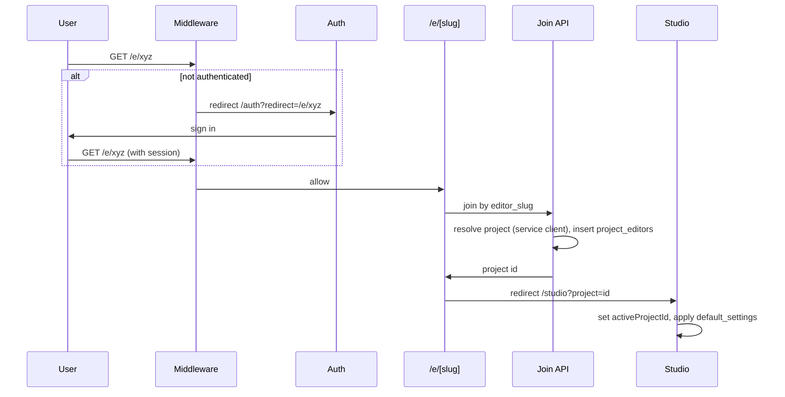

# Editor link: share project for editing (revised v3)

> **Revision note (v3):** This plan was updated to incorporate the **security critique** (see [editor_link_shared_projects_security_critique.md](viewbait/docs/critiques/editor_link_shared_projects_security_critique.md)). Additions: redirect allowlist for auth callback, auth page, and onboarding (prevent open redirect); editor_slug validation (max length, URL-safe charset) on join and PATCH; explicit rule that `?project=` may be applied only when the project id is in the user's project list; rate limiting on join-by-editor-slug; and when "remove editor" is implemented, owner-only with server-side verification.
>
> **Prior revision (v2):** Incorporated the design critique: studio `?project=` handling, share dialog editor link block, thumbnail project validation for editors, onboarding redirect preservation.
>
> **Prior revision (v1):** Incorporated the senior-engineer critique: thumbnails-list when `projectId` set; join uses **service client**; GET /api/projects two-query merge with `isShared`; onboarding and OAuth allowlist callouts.

---

## Current state

- **Gallery share**: `[/p/[slug]](viewbait/app/p/[slug]/page.tsx)` uses `share_slug` for view-only gallery; no auth.
- **Projects**: Owned only; list from `[GET /api/projects](viewbait/app/api/projects/route.ts)` via `[listProjects](viewbait/lib/server/data/projects.ts)` (user_id match). `[ProjectSelector](viewbait/components/studio/project-selector.tsx)` and studio state use `projects` from `[useProjects](viewbait/lib/hooks/useProjects.ts)`.
- **Studio**: `[activeProjectId](viewbait/components/studio/studio-provider.tsx)` from localStorage; project `default_settings` applied when switching project (lines 581–611). No URL param for "open this project".
- **Auth**: Middleware protects `/studio` and `/onboarding`; redirects to `/auth?redirect=...`. [Auth callback](viewbait/app/auth/callback/route.ts) supports `next`/`redirect` for post-login URL. [Auth page](viewbait/app/auth/page.tsx) uses `redirect` query for post-login destination.
- **Generate**: `[project_id](viewbait/app/api/generate/route.ts)` is validated with `getProjectById(supabase, body.project_id, user.id)` (owner-only).
- **RLS**: Projects and thumbnails are strictly owner-scoped ([006_rls_core_tables.sql](viewbait/supabase/migrations/006_rls_core_tables.sql), [003](viewbait/supabase/migrations/003_projects_and_thumbnails_project_id.sql)). Thumbnails: `user_id = auth.uid()` for SELECT/INSERT/UPDATE/DELETE.
- **Types**: `[DbProject](viewbait/lib/types/database.ts)` has no `editor_slug` or `share_slug` in the snippet (server uses `share_slug`/`share_mode` in PROJECT_FIELDS). You stated the DB already has `editor_slug`; types and any missing migration should be aligned.

---

## 1. URL and auth flow

- **Editor link URL**: `/e/[editorSlug]` (e.g. `/e/xyz123`).
- **Middleware**: Treat `/e` (and `/e/*`) as a protected route so unauthenticated users are sent to `/auth?redirect=/e/<slug>`.
- **Auth callback**: No change; it already redirects to `next`/`redirect`. After login, user lands on `/e/<slug>`.
- `**/e/[slug]` page (new)**:
  - Client page; middleware already ensured user is authenticated when they hit it.
  - Call an API to "resolve project by editor_slug and add me as editor" (idempotent).
  - On success: redirect to `/studio?project=<projectId>` (or same with `replaceState`-style cleanup).
  - On failure (invalid slug / not found): show error and link to home or studio.

> [CRITIQUE-BASED UPDATE] **OAuth redirect allowlist:** Confirm that `/e/*` (or the app origin + path `/e/...`) is an allowed redirect URL in Supabase Auth and in the OAuth provider (e.g. Google) so that post-login redirect to the editor link works. Add this to deployment/checklist.

> [SECURITY-CRITIQUE UPDATE] **Redirect validation (open redirect prevention):** All user-controlled redirect/next parameters must be validated before use. **Auth callback** ([app/auth/callback/route.ts](viewbait/app/auth/callback/route.ts)) and **auth page** ([app/auth/page.tsx](viewbait/app/auth/page.tsx)) currently use `next`/`redirect` without validation; an absolute URL (e.g. `https://evil.com`) would redirect the user off-site after login. Require a **redirect allowlist**: allow only relative paths (e.g. start with `/` and not `//`) or a small allowlist (e.g. `/`, `/studio`, `/studio?project=*`, `/e/*`, `/onboarding`). Reject or fall back to `/studio` for any other value. Apply the same rule when implementing **onboarding** stored redirect: before navigating after completion, validate the stored redirect (allowlist or same-origin path only). Add a shared helper (e.g. `isAllowedRedirect(pathOrUrl, requestOrigin)`) and use it in callback, auth page, and onboarding completion.

Result: User opens editor link → if not signed in, sign in → then land on studio with that project loaded.

---

## 2. Database and types

- **projects.editor_slug**: You said the column already exists. Ensure TypeScript types include it (e.g. in `DbProject`, `ProjectUpdate`, and any API response types). If a migration is missing, add one (e.g. `ADD COLUMN IF NOT EXISTS editor_slug text UNIQUE`, plus unique partial index and comment), following the pattern of [004_projects_share_slug_and_share_mode.sql](viewbait/supabase/migrations/004_projects_share_slug_and_share_mode.sql).
- **project_editors table (new)**:
  - Columns: `project_id` (uuid, FK to projects, ON DELETE CASCADE), `user_id` (uuid, FK to auth.users).
  - Unique constraint on `(project_id, user_id)`.
  - Purpose: when a user opens `/e/:slug`, insert (project_id, current user) if not exists; used to list "shared with me" and to allow creating/listing thumbnails in that project.
- **RLS for projects**:
  - **SELECT**: Allow if `user_id = auth.uid()` OR `id IN (SELECT project_id FROM project_editors WHERE user_id = auth.uid())`. So owners and editors see the project.
  - **INSERT/UPDATE/DELETE**: Keep owner-only (`user_id = auth.uid()`). Editors do not create/update/delete the project row; they only add thumbnails to it.
- **RLS for thumbnails**:
  - **SELECT**: Allow if `user_id = auth.uid()` OR (`project_id IS NOT NULL` AND `project_id IN (SELECT project_id FROM project_editors WHERE user_id = auth.uid())`). So users see their own thumbnails plus all thumbnails in projects they edit.
  - **INSERT**: Keep `WITH CHECK (user_id = auth.uid())`. Allow any `project_id` that the user is allowed to use (owned or editable); validation in API (see below).
  - **UPDATE/DELETE**: Keep current (only thumbnail owner). Optional: later allow project owner to delete any thumbnail in the project if desired.

---

## 3. API layer

- **GET /api/projects** (list):
  - Return projects where user is owner **or** in `project_editors`. Include a flag per project: `**isShared: boolean**` (true when the user is editor, not owner), so the UI can group or label "Shared with you".
  - > [CRITIQUE-BASED UPDATE] **Implementation:** Prefer a **two-query merge**: (1) list projects where `user_id = auth.uid()` (owned); (2) list `project_id`s from `project_editors` where `user_id = auth.uid()`, then fetch those project rows (with user session; RLS will allow after policy update), merge with `isShared: true`. Document that GET /api/projects returns both owned and shared and that each project has `isShared: boolean`. Avoid relying on a single SELECT with complex RLS if it obscures which rows are "shared"; the two-query merge is clearer.
- **"Join by editor slug"**:
  - New endpoint, e.g. **POST /api/projects/join-by-editor-slug** (body: `{ "editor_slug": "..." }`) or **GET /api/projects/editor/[slug]** that:
    - > [CRITIQUE-BASED UPDATE] **Resolve project:** Use the **service client** (or equivalent privileged client) to look up the project by `editor_slug`. The project is owned by another user, so a normal user-scoped client cannot SELECT it due to RLS. Service client bypasses RLS for the lookup. Project must exist and have non-null `editor_slug`.
    - > [SECURITY-CRITIQUE UPDATE] **Editor slug validation:** Before lookup, validate `editor_slug`: max length (e.g. 64–128 chars), allowed charset (e.g. alphanumeric and hyphen only, `[a-zA-Z0-9-]`). Reject with 400 if invalid. This prevents abuse, DoS from very long input, and edge cases in URLs/logging.
    - Insert into `project_editors` for (project_id, current user) if not already present (idempotent). Use current user from `requireAuth`; only the joining user is added. Service client or a dedicated helper can perform the insert.
    - Return project (id, name, default_settings, etc.) so the client can redirect to `/studio?project=<id>`.
  - Use `requireAuth`; only the joining user is added.
  - > [SECURITY-CRITIQUE UPDATE] **Rate limiting:** Consider rate limiting on POST /api/projects/join-by-editor-slug (e.g. per user or per IP: max N requests per minute) to reduce slug enumeration and abuse. Add to deployment/operational checklist.
- **PATCH /api/projects/[id]** (existing):
  - Allow owner to set `editor_slug` (enable/disable editor link), same pattern as `share_slug`: generate unique slug on enable, set null on disable. Include `editor_slug` in select/response. If the API accepts client-set `editor_slug` (not only server-generated via `editor_link_enabled: true`), apply the same validation as join: max length, URL-safe charset (e.g. alphanumeric + hyphen); reject invalid values with 400.
- **Generate (POST /api/generate)**:
  - When `body.project_id` is set, allow project if user is **owner or editor** (e.g. new helper `getProjectByIdOrEditable(supabase, projectId, userId)` that checks project ownership or `project_editors`). Keep using `user_id = auth.uid()` for the inserted thumbnail row.
- **Thumbnails list (GET /api/thumbnails)**:
  - > [CRITIQUE-BASED UPDATE] **Critical:** When `**projectId` is provided**, do **not** apply a `user_id` filter. Filter only by `project_id` (and optional favorites/sort). RLS will limit results to projects the user owns or is in `project_editors` for, and the new thumbnails SELECT policy allows seeing all thumbnails in those projects. So editors (and owners) see **all** thumbnails in the project when viewing by project. When `**projectId` is not provided** (list "all my thumbnails"), keep current behavior: use `user_id = auth.uid()` so the user sees only their own thumbnails across all projects.
  - Implementation: In [buildThumbnailsQuery](viewbait/lib/server/data/thumbnails.ts), when `projectId` is set, use a separate code path that does **not** use `QueryPatterns.userOwnedWithFavorites` (which adds `.eq('user_id', userId)`). Instead build a query that filters only by `project_id`, ordering, and optional favorites; rely on RLS for access control. Optionally add a query-builder helper for "thumbnails by project (RLS-only)" to keep logic centralized.

> [DESIGN-CRITIQUE UPDATE] **Thumbnail project assignment (PATCH /api/thumbnails/[id] and POST /api/thumbnails/[id]/project):** When validating `project_id` (assigning or moving a thumbnail to a project), use **owner-or-editor** semantics so that editors can assign their thumbnails to the shared project. Use `getProjectByIdForAccess(supabase, projectId)` (or equivalent) instead of `getProjectById(supabase, projectId, user.id)`. If the project is returned (user is owner or in project_editors), allow the assignment. Thumbnail row ownership stays unchanged (`user_id = auth.uid()` for the thumbnail); only the **project** access check must allow editors. Apply this in both [app/api/thumbnails/[id]/route.ts](viewbait/app/api/thumbnails/[id]/route.ts) (PATCH body `project_id`) and [app/api/thumbnails/[id]/project/route.ts](viewbait/app/api/thumbnails/[id]/project/route.ts) (POST body `project_id`).

---

## 4. Studio: open project from URL and settings

- `**/studio?project=<id>**`:
  - In studio layout/page or provider: on mount, read `project` from `useSearchParams()`. If present and the project is in the combined list (owned + shared), set `activeProjectId` to that id and persist to localStorage; then clear the query (e.g. `replaceState` or `router.replace` without `project`) so refreshing doesn't re-apply.
  - > [SECURITY-CRITIQUE UPDATE] **IDOR prevention:** Only set `activeProjectId` from `?project=` when that project id is present in the **user's** project list (from GET /api/projects). Do not apply arbitrary project ids from the URL; the list is RLS-scoped, so a malicious `?project=<other_user_project_id>` will not appear and must not be applied.
  - If `project` is not in the list yet (e.g. race with projects fetch), wait for projects to load and then set active project if the id appears (e.g. after join-by-editor-slug and refetch).

> [DESIGN-CRITIQUE UPDATE] **Implementation (required for editor-link UX):** The provider currently initializes `activeProjectId` only from localStorage; nothing reads `?project=` from the URL. Add a dedicated component (e.g. `StudioProjectFromQuery`) that: (1) reads `project` from `useSearchParams()`; (2) when projects have loaded, if that id is in the combined list, calls `setActiveProjectId(id)` and persists to localStorage; (3) clears the `project` query param (e.g. via `router.replace` without `project`) so a refresh does not re-apply. Handle the race where the project list may load after the join (e.g. refetch projects after join on /e/[slug], or in the component wait for projects and then set active project if the id appears). Mount this component inside the studio page (e.g. alongside `StudioViewFromQuery`) so it runs when the user lands on `/studio?project=<id>` after the editor link redirect.

- **Settings**: Project `default_settings` are already applied in [studio-provider](viewbait/components/studio/studio-provider.tsx) when `activeProjectId` or `projects` change. No extra "settings in URL" is needed; the shared project's saved settings are loaded when the editor opens that project.

---

## 5. Project selector and projects tab

- **Project selector**: Consume the extended project list (owned + shared with `isShared`). Show shared projects in the same dropdown; optionally group (e.g. "My projects" / "Shared with you") or show a small "Shared" label next to the name. Same `activeProjectId` / `setActiveProjectId` behavior; no change to create-project flow (new projects remain owned).
- **Projects tab (sidebar)**: Use the same list so shared projects appear there; sort/filter in a similar way to owned projects (e.g. by name or updated_at). Distinguish shared vs owned in the list if desired (e.g. icon or label).

---

## 6. Share dialog: editor link

- In [ShareProjectDialog](viewbait/components/studio/share-project-dialog.tsx):
  - Add a second block for **"Editor link"**: enable/disable (toggle or button) that sets/clears `editor_slug` via existing PATCH.
  - When enabled, show copyable URL: `${origin}/e/${editor_slug}`.
  - Copy button and short description: e.g. "Signed-in users who open this link will be added as editors and can add thumbnails to this project with the same settings."
- Reuse the same slug-generation pattern as `share_slug` (unique, URL-safe); ensure `editor_slug` is included in the project update payload and API response.

> [DESIGN-CRITIQUE UPDATE] **Implementation note:** The dialog currently implements only the gallery share block. The "Editor link" block must be implemented so owners can create and copy the editor link from the UI. Reuse the same copy/error/saving patterns as the gallery block. PATCH /api/projects/[id] already allows the owner to set `editor_slug` (enforced by `user_id` in updateProject); the server generates the slug on enable when the client sends e.g. `editor_link_enabled: true` (or similar contract). Ensure the dialog shows the Editor link section only for the project owner (shared projects do not show the share dialog for editing the link).

---

## 7. Data flow summary

---

## 8. Files to touch (concise)

| Area             | Files                                                                                                                                                                                                                                                                                                                                                                                                                                    |
| ---------------- | ---------------------------------------------------------------------------------------------------------------------------------------------------------------------------------------------------------------------------------------------------------------------------------------------------------------------------------------------------------------------------------------------------------------------------------------- |
| Middleware       | [middleware.ts](viewbait/middleware.ts): add `/e` to protected routes; when redirecting to onboarding from /studio, preserve destination as `?redirect=<encoded_url>` (e.g. `/studio?project=xxx`). Validate redirect before passing (allowlist or same-origin path) to avoid open redirect.                                                                                                                                                                                                       |
| Auth / redirect  | [app/auth/callback/route.ts](viewbait/app/auth/callback/route.ts), [app/auth/page.tsx](viewbait/app/auth/page.tsx): validate `next`/`redirect` with allowlist or same-origin path; fallback to `/studio` if invalid. Add shared helper e.g. `isAllowedRedirect()`.                                                                                                                                                                                                                                      |
| New page         | New `app/e/[slug]/page.tsx`: call join API, redirect to `/studio?project=...`.                                                                                                                                                                                                                                                                                                                                                           |
| Types            | [lib/types/database.ts](viewbait/lib/types/database.ts): add `editor_slug` to `DbProject`, `ProjectUpdate`; ensure share fields present if used.                                                                                                                                                                                                                                                                                         |
| Server data      | [lib/server/data/projects.ts](viewbait/lib/server/data/projects.ts): add `getProjectByEditorSlug` (service client), extend list to include projects where user is editor (two-query merge with isShared); add project_editors usage where needed.                                                                                                                                                                                        |
| API routes       | New join endpoint using **service client** for project lookup; **validate editor_slug** (max length, URL-safe charset) before lookup; [api/projects/route.ts](viewbait/app/api/projects/route.ts) GET merge shared (two-query); [api/projects/[id]/route.ts](viewbait/app/api/projects/[id]/route.ts) PATCH handle `editor_slug` (same slug validation if client can set it); [api/generate/route.ts](viewbait/app/api/generate/route.ts) allow project_id for editable projects. **Thumbnail project validation:** [api/thumbnails/[id]/route.ts](viewbait/app/api/thumbnails/[id]/route.ts) and [api/thumbnails/[id]/project/route.ts](viewbait/app/api/thumbnails/[id]/project/route.ts): use `getProjectByIdForAccess`. **Rate limiting:** Consider rate limit on POST /api/projects/join-by-editor-slug (deployment/checklist). |
| Thumbnails list  | [lib/server/data/thumbnails.ts](viewbait/lib/server/data/thumbnails.ts): when `projectId` is set, do not use `userOwnedWithFavorites`; filter by `project_id` only and rely on RLS. [lib/server/utils/query-builder.ts](viewbait/lib/server/utils/query-builder.ts): optional helper for "thumbnails by project (RLS-only)".                                                                                                                                                                             |
| RLS / migrations | New migration: `project_editors` table; projects/thumbnails RLS updates; add `editor_slug` if not in DB.                                                                                                                                                                                                                                                                                                                                 |
| Services/hooks   | [lib/services/projects.ts](viewbait/lib/services/projects.ts): add joinByEditorSlug (or getProjectByEditorSlug + join); [lib/hooks/useProjects.ts](viewbait/lib/hooks/useProjects.ts): ensure list includes shared (from API).                                                                                                                                                                                                           |
| Studio           | [app/studio/page.tsx](viewbait/app/studio/page.tsx): add component that reads `?project=`, sets activeProjectId when project is in list, persists to localStorage, clears param (e.g. `StudioProjectFromQuery`). [components/studio/project-selector.tsx](viewbait/components/studio/project-selector.tsx): show shared projects (optional grouping/label). [components/studio/studio-provider.tsx](viewbait/components/studio/studio-provider.tsx): ensure projects list passed to selector includes shared; expose setActiveProjectId for URL-sync component. |
| Share dialog     | [components/studio/share-project-dialog.tsx](viewbait/components/studio/share-project-dialog.tsx): **add Editor link block**: enable/disable editor_slug, copy `/e/<slug>` URL, same copy/error/saving patterns as gallery block; show only for project owner.                                                                                                                                                                                                 |
| Onboarding       | [middleware.ts](viewbait/middleware.ts): when redirecting to /onboarding from /studio, use `/onboarding?redirect=<encoded_destination>` (validate destination with allowlist before encoding). [app/onboarding/page.tsx](viewbait/app/onboarding/page.tsx): read `redirect` from searchParams, **validate** (allowlist or same-origin path only) before storing; on completion, navigate to stored redirect only if valid, else `/studio`.                                                                                                                                  |
| Sidebar projects | Wherever "projects" tab list is built: use same combined list (owned + shared).                                                                                                                                                                                                                                                                                                                                                          |

---

## 9. Edge cases and notes

- **Onboarding**: If studio redirects to onboarding for new users, the flow "editor link → auth → /e/slug → redirect /studio?project=id" might send them to onboarding first.
  - > [CRITIQUE-BASED UPDATE] **Preserve redirect through onboarding:** When redirecting to onboarding (e.g. from /studio), preserve the intended destination (e.g. `/studio?project=...`) in sessionStorage or a query param so that after onboarding is completed, the user is sent to that URL. Implement onboarding completion to read that stored redirect and send the user to the editor's project when applicable. Decide whether editor-link users skip onboarding or complete it then land on studio with project set; middleware currently sends incomplete onboarding to `/onboarding`.

  - > [DESIGN-CRITIQUE UPDATE] **Concrete implementation:** (1) In **middleware**, when redirecting to onboarding (e.g. user hit /studio or /studio?project=xxx but has not completed onboarding), redirect to `/onboarding?redirect=<encodeURIComponent(originalPathAndQuery)>` (e.g. `redirect=/studio%3Fproject%3Dxxx`). (2) On the **onboarding page**, on load read `redirect` from searchParams and store it (e.g. in sessionStorage under a key like `onboarding_redirect`) so it survives step navigation. (3) When the user **completes onboarding** (e.g. on "Go to Studio" or when marking onboarding complete), navigate to the stored redirect if present and valid, otherwise to `/studio`. This ensures editor-link users who must complete onboarding still land on the shared project afterward.
  - > [SECURITY-CRITIQUE UPDATE] **Onboarding redirect validation:** Before storing or using the onboarding `redirect` parameter, validate it (same allowlist as auth: relative paths or allowlisted paths only). Do not navigate to raw user input; reject or fall back to `/studio` if invalid.

- **Editor slug uniqueness**: Same as `share_slug`—globally unique; generate on enable, clear on disable.
- **Removing editors**: Out of scope for this plan; can be added later (e.g. owner-only endpoint to delete from `project_editors`).
  - > [SECURITY-CRITIQUE UPDATE] **When implementing "remove editor":** Only the **project owner** may remove an editor. Use **server-side** checks: resolve project by id, verify `project.user_id = auth.uid()`, then delete the target row from `project_editors`. Do not rely solely on client-supplied editor user_id without verifying project ownership. RLS on project_editors has no DELETE policy today; add an owner-only policy or use a server path that verifies ownership before deleting.
- **Settings**: Owner saves `default_settings` on the project; when an editor opens the project (via link or selector), existing studio logic applies `default_settings`; no separate "settings in URL" needed.

- **Security (redirect and input):**
  - **Redirect allowlist:** Auth callback, auth page, and onboarding must validate all redirect/next parameters (allowlist of relative paths or allowlisted paths; reject absolute URLs and `//...`). Use a shared helper and fall back to `/studio` when invalid.
  - **?project=:** Only apply when the value is a project id that appears in the user's project list (from GET /api/projects); never apply arbitrary ids from the URL.
  - **Editor slug:** Validate on join (and on PATCH if client can set): max length (e.g. 64–128 chars), URL-safe charset (e.g. alphanumeric + hyphen). Reject with 400 if invalid.
  - **Rate limiting:** Consider rate limiting on POST /api/projects/join-by-editor-slug (deployment/operational checklist).
