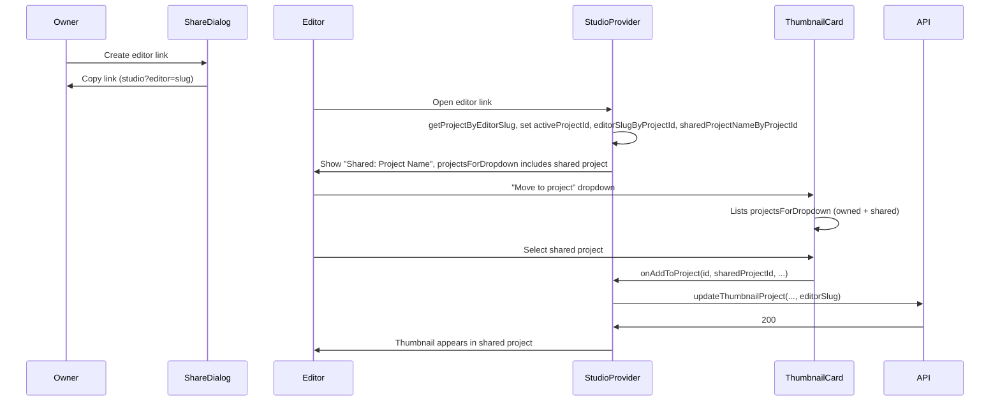

# Shared project editor link – dropdown and testing guide (revised)

> **Revision note:** This plan incorporates feedback from the senior-engineer critique (`shared_editor_link_testing_guide_critique.md`): explicit implementation checklist to avoid partial/incomplete provider code, testing-guide note for async project name, and post-implementation verification.

## Current state

- **Owner** can create/copy an **editor link** from the Share dialog (`/studio?editor=<slug>`). The link is in the front-end and working.
- **Editor** opening that link sees "Shared: &lt;Project Name&gt;" in the project switcher, can **generate** new thumbnails into the project, and can delete only their own thumbnails.
- **Gap:** The "Move to project" / "Add to project" dropdown on thumbnail cards only lists **owned** projects (`data.projects` from `useProjects()`). The shared project is not in that list, so step 4.3 in the testing guide ("Move to project → select the shared project") cannot be done yet.

## 1. Show shared project in "Move to project" dropdown

**Goal:** When the user is in editor mode (they opened the studio via an editor link), the shared project should appear in the dropdown so they can move their existing thumbnails into it.

**Approach:** In the provider, maintain a small map of shared project **names** keyed by project id (we already have ids and slugs in `editorSlugByProjectId`). When we resolve the editor slug on load, we already get `projectName` from `getProjectByEditorSlug`; store it. Expose a derived list `projectsForDropdown` that is owned projects plus any project ids present in `editorSlugByProjectId` that are not owned, with names from the stored map (fallback: "Shared project"). Use this list only for the add/move project dropdown so the rest of the app (e.g. project switcher, project list) still uses owned projects only.

### 1.1 Implementation checklist (provider)

> [CRITIQUE-BASED UPDATE] The codebase may have a partial implementation (interface and hook reference `projectsForDropdown`, effect calls `setSharedProjectNameByProjectId`, but state and `data` useMemo may be missing). Complete **all three** of the following so the implementation matches the interface and works at runtime:

1. **State:** Declare `sharedProjectNameByProjectId` in the provider:
   - `const [sharedProjectNameByProjectId, setSharedProjectNameByProjectId] = useState<Record<string, string>>({});`
   - When resolving the editor link (inside the existing `useEffect` that calls `getProjectByEditorSlug`), after setting `activeProjectId` and `editorSlugByProjectId`, set the project name:  
     `setSharedProjectNameByProjectId(prev => ({ ...prev, [projectId]: projectName ?? 'Shared project' }))`.

2. **Data useMemo:** In the same `useMemo` that builds `data`:
   - Compute `projectsForDropdown`: owned `projects` mapped to `{ id, name }` plus, for each `projectId` in `editorSlugByProjectId` that is **not** in `projects`, append `{ id: projectId, name: sharedProjectNameByProjectId[projectId] ?? 'Shared project' }`.
   - Add `projectsForDropdown` to the returned object.
   - Include `sharedProjectNameByProjectId` in the useMemo dependency array so the dropdown updates when the project name loads.

3. **useThumbnailActions:** Return `projects: data.projectsForDropdown` (not `data.projects`) so the thumbnail card dropdown uses the combined list.

**Files to change**

- [components/studio/studio-provider.tsx](viewbait/components/studio/studio-provider.tsx)
  - **State:** Add `sharedProjectNameByProjectId: Record<string, string>` as above; ensure the editor-link `useEffect` calls `setSharedProjectNameByProjectId` after resolving the slug.
  - **Data:** Add `projectsForDropdown` to `StudioData`: type `Array<{ id: string; name: string }>`. Compute in the same `useMemo` as `data` (see checklist step 2). Include `projectsForDropdown` in the returned `data` object and `sharedProjectNameByProjectId` in the dependency array.
  - **Interface:** Extend `StudioData` with `projectsForDropdown: Array<{ id: string; name: string }>`; keep `projects: DbProject[]` unchanged.
- [components/studio/studio-provider.tsx](viewbait/components/studio/studio-provider.tsx) – **useThumbnailActions**
  - Return `projects: data.projectsForDropdown` instead of `data.projects` so the thumbnail card dropdown uses the combined list.
- [components/studio/thumbnail-card.tsx](viewbait/components/studio/thumbnail-card.tsx)
  - The dropdown already uses `project.id` and `project.name` and calls `onAddToProject(id, project.id, projectId ?? null)`. The provider’s `onAddToProject` already uses `editorSlugByProjectId[newProjectId]` when calling the API. No change needed here once `projects` from the hook is `projectsForDropdown` (which includes the shared project with correct id; the slug is already in `editorSlugByProjectId`).

**Edge cases**

- If the shared project is also in the user’s owned list (e.g. owner viewing their own project), do not duplicate it in `projectsForDropdown` (only add entries for ids not in `projects`).
- Multiple editor links in the same session: `editorSlugByProjectId` can have multiple ids; we support them by iterating over its keys and adding each missing project with its stored name.

## 2. Manual testing guide

**Goal:** One step-by-step manual testing guide in `docs/guides/` that verifies the full flow: owner gets shareable editor links in the UI, editor opens the link and can add thumbnails (generate and move existing), and all described behaviors are testable.

**File:** [docs/guides/shared-projects-editor-link-testing.md](viewbait/docs/guides/shared-projects-editor-link-testing.md)

- **Rewrite** the guide so it stays a single, clear manual-test doc (prerequisites, Part A without migration, Part B with migration, then numbered sections for owner and editor flows).
- **Ensure the following are explicitly covered:**
  - **Owner:** Create project, add thumbnails, open Share, create/copy **editor link** (link visible and copyable in the front-end).
  - **Editor:** Open editor link, sign in, see "Shared: &lt;Project Name&gt;", see all project thumbnails.
  - **Editor – add thumbnails:**  
    - Generate a new thumbnail with the shared project selected (already documented).  
    - **Move existing thumbnail:** Switch to "All thumbnails" (or another project), open the "Move to project" (or "Add to project") dropdown on a thumbnail they own, and **select the shared project**; confirm the thumbnail moves and appears when viewing the shared project.
  - **Editor:** Delete only own thumbnails (no delete on owner’s).
  - **Owner:** Verify editor’s thumbnails, revoke/rotate editor link; editor link no longer works.
- **Update step 4.3** (or equivalent) to state that the shared project **appears in the "Move to project" dropdown** when in editor mode and that the user can select it to move a thumbnail into the shared project.
- > [CRITIQUE-BASED UPDATE] **Async project name:** Add a one-line note in the guide (e.g. in the Editor "Open link and view project" section or in Troubleshooting): *"You may briefly see 'Shared project' in the switcher or in the Move to project dropdown before the actual project name loads."* This sets expectations for the async resolution of `getProjectByEditorSlug`.
- Keep existing sections that are still accurate (prerequisites, API checks, troubleshooting, quick reference table). Remove or adjust any step that said the shared project is not in the switcher dropdown: clarify that the shared project is **not** in the **switcher** list (only "All thumbnails" + owned projects), but **is** in the **thumbnail card** "Move to project" / "Add to project" dropdown when in editor mode.

## 3. Flow summary

## 4. Out of scope (no code changes)

- Adding the shared project to the **project switcher** dropdown (list of projects to switch to). The guide and design keep the current behavior: switcher shows "All thumbnails" + owned projects; the shared project is only the current context when arrived via link and appears in the **thumbnail** add/move dropdown.
- Gallery view project filter: still only owned projects (optional future improvement).

## 5. Verification

- Owner: Create project → Share → Create editor link → copy link. Editor: Open link → see Shared project → Generate thumbnail into project → Switch to All thumbnails → on one of their thumbnails open "Move to project" → shared project is in the list → select it → thumbnail moves. Owner: See editor’s thumbnail in project. Editor: Revoked link no longer works.
- Manual testing guide: Follow the guide step-by-step; step "Move to project → select the shared project" is possible and passes.

> [CRITIQUE-BASED UPDATE] **Post-implementation:** After completing the provider changes and guide updates, run through the manual testing guide once end-to-end to confirm step 4.3 (move existing thumbnail into shared project) and the revoke/rotate steps work as described. This validates that the implementation matches the interface and that the guide is accurate.
