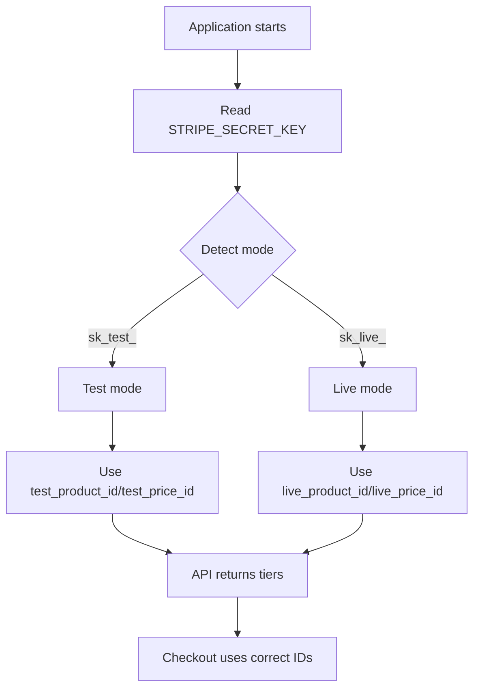

# Stripe Setup Guide

## Overview

The application automatically switches between Stripe test mode and live mode based on your `STRIPE_SECRET_KEY` environment variable. This eliminates the need to manually update price IDs when switching between development and production environments.

## How It Works

The system detects Stripe mode by checking the prefix of `STRIPE_SECRET_KEY`:
- **Test mode**: Keys starting with `sk_test_` → Uses `test_product_id` and `test_price_id` from database
- **Live mode**: Keys starting with `sk_live_` → Uses `live_product_id` and `live_price_id` from database

The data layer automatically selects the correct IDs when converting database tiers to `TierConfig` format, so all API routes and services automatically use the correct IDs for the current environment.

## Database Schema

The `subscription_tiers` table stores both test and live mode IDs:

- `test_product_id` - Stripe test mode product ID
- `test_price_id` - Stripe test mode price ID
- `live_product_id` - Stripe live mode product ID
- `live_price_id` - Stripe live mode price ID

## Setup Steps

### 1. Run Migrations

Apply the database migrations to add the new columns:

```bash
# If using Supabase CLI
supabase migration up

# Or apply via Supabase Dashboard SQL Editor
# Run: supabase/migrations/037_create_subscription_tiers.sql
# Then: supabase/migrations/038_add_stripe_mode_columns.sql
```

### 2. Configure Environment Variables

Set your Stripe secret key based on the environment:

**Local Development (.env.local):**
```bash
STRIPE_SECRET_KEY=sk_test_...
STRIPE_WEBHOOK_SECRET=whsec_test_...
```

**Production (Vercel/Environment Variables):**
```bash
STRIPE_SECRET_KEY=sk_live_...
STRIPE_WEBHOOK_SECRET=whsec_live_...
```

### 3. Verify Test Mode IDs

The migration `038_add_stripe_mode_columns.sql` automatically seeds test mode IDs. Verify they match your Stripe test mode products:

- **Starter**: `prod_TheusnKZChDYuY` / `price_1SkFb8Bb0t6nzbzXRbWaholA`
- **Advanced**: `prod_Thevmvqf390H46` / `price_1SkFbUBb0t6nzbzXvG43HAgX`
- **Pro**: `prod_ThevxW1nLazlId` / `price_1SkFbuBb0t6nzbzXKpXloTJL`

### 4. Verify Live Mode IDs

The migration `037_create_subscription_tiers.sql` seeds live mode IDs. Verify they match your Stripe live mode products:

- **Starter**: `prod_TnOEfTPCWPeut0` / `price_1SpnRzBcGinvfEOd5vU9kiUZ`
- **Advanced**: `prod_TnOE0WHc7ULK65` / `price_1SpnRvBcGinvfEOd6YgtY8OZ`
- **Pro**: `prod_TnOEIZWJU0VdPU` / `price_1SpnRsBcGinvfEOdo4JUCLkU`

## Updating Price IDs

If you need to update price IDs in the database:

### Via Supabase Dashboard

1. Go to Table Editor → `subscription_tiers`
2. Edit the tier row
3. Update `test_product_id` / `test_price_id` for test mode
4. Update `live_product_id` / `live_price_id` for live mode
5. Save changes

### Via SQL

```sql
-- Update test mode IDs
UPDATE subscription_tiers
SET 
  test_product_id = 'prod_...',
  test_price_id = 'price_...'
WHERE tier_name = 'starter';

-- Update live mode IDs
UPDATE subscription_tiers
SET 
  live_product_id = 'prod_...',
  live_price_id = 'price_...'
WHERE tier_name = 'starter';
```

## Getting Your Stripe IDs

### Test Mode IDs

1. Go to [Stripe Dashboard](https://dashboard.stripe.com/test/products)
2. Make sure you're in **Test mode** (toggle in top right)
3. Navigate to Products
4. Click on your product
5. Copy the Product ID (starts with `prod_`)
6. Copy the Price ID (starts with `price_`)

### Live Mode IDs

1. Go to [Stripe Dashboard](https://dashboard.stripe.com/products)
2. Make sure you're in **Live mode** (toggle in top right)
3. Navigate to Products
4. Click on your product
5. Copy the Product ID (starts with `prod_`)
6. Copy the Price ID (starts with `price_`)

## Troubleshooting

### "No such price" Error

This error occurs when:
- You're using test mode Stripe keys but the database has live mode price IDs (or vice versa)
- The price ID in the database doesn't exist in your Stripe account

**Solution:**
1. Verify your `STRIPE_SECRET_KEY` matches the mode you're testing
2. Check that the database has the correct IDs for the current mode
3. Verify the IDs exist in your Stripe dashboard for the current mode

### Price IDs Not Updating

If changes to the database aren't reflected:
1. The cache refreshes every 5 minutes
2. Restart your development server to clear the cache immediately
3. Or wait for the cache TTL to expire

## Architecture



## Related Files

- `supabase/migrations/037_create_subscription_tiers.sql` - Initial tier table with live IDs
- `supabase/migrations/038_add_stripe_mode_columns.sql` - Adds test/live columns and test IDs
- `lib/server/data/subscription-tiers.ts` - Mode-aware data layer
- `lib/services/stripe.ts` - Stripe service with mode detection
